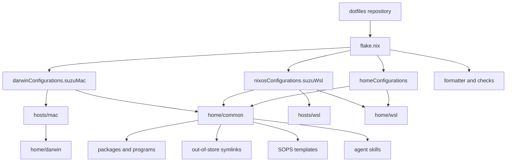

# 構成と責務

このリポジトリは、macOSとNixOS-WSLの対象環境を一つのflakeから構築する。
Nixが依存関係とシステム構成を評価し、Home Managerが共通ユーザー環境を組み立て、HomebrewがmacOSアプリケーションの一部を補う。

現在の主環境はmacOSである。
NixOS-WSLは、Windows側でUnityなどを使う作業中も共通ユーザー環境を利用するための補助対象環境としている。
今後もmacOSと同じ水準でWSL構成を保守するかは決めていない。

## 構成の流れ

`flake.nix` は対象環境と検証処理の入口である。
共通ユーザー環境はmacOSとWSLの両方から読み込み、OSやホストに依存する設定は個別のmoduleへ分離する。

## Flakeの出力

| 出力 | システム | 役割 |
| --- | --- | --- |
| `darwinConfigurations.suzuMac` | `aarch64-darwin` | 主環境のmacOSシステム設定とHome Manager設定 |
| `nixosConfigurations.suzuWsl` | `x86_64-linux` | 補助対象環境のNixOS-WSLシステム設定とHome Manager設定 |
| `homeConfigurations.nixos` | `x86_64-linux` | 補助対象環境向けHome Manager設定の単独出力 |
| `homeConfigurations."nixos@suzuWsl"` | `x86_64-linux` | 同じWSL向けHome Manager設定のホスト名付き出力 |
| `checks.aarch64-darwin.*` | `aarch64-darwin` | 主環境で実行するformatter、静的解析、シェルと設定ファイルの検証 |

macOSではnix-darwinがシステム設定を所有する。
WSLではNixOS-WSL moduleが基盤を作り、Home Managerがユーザー環境を追加する。

## Nix moduleの境界

| 場所 | 責務 |
| --- | --- |
| `.config/nix/hosts/` | ホストごとのシステム入口 |
| `.config/nix/home/common/` | 両方の対象環境で共有するパッケージ、プログラム、dotfile、SOPS、agent skills |
| `.config/nix/home/darwin/` | macOSのユーザー設定、システム既定値、Homebrew、launchd |
| `.config/nix/home/wsl/` | WSLのユーザー名、ホームディレクトリ、ブラウザ連携 |
| `.config/nix/overlays/` | flakeから共通利用するローカルパッケージ |

新しい設定は、利用する対象環境が一つなら対応するplatformまたはhost moduleへ置く。
両方の対象環境で同じ振る舞いが必要な場合だけ、`home/common/`へ置く。

## NixとHomebrewの境界

NixはCLI、開発ツール、シェル、エディタ、システム構成を管理する。
HomebrewはmacOS GUIアプリケーションと、Nixで扱いにくいmacOS固有ツールを補う。

`.config/nix/home/darwin/homebrew.nix` はアプリケーションを次の集合に分ける。

- **`managedBrews`**：nix-darwinがインストールするformula。
- **`managedCasks`**：nix-darwinがインストールするcask。
- **`manualCasks`**：存在だけを記録し、自動操作しないcask。
- **`upgradableCasks`**：補助スクリプトによる更新を許可したcask。

activationではHomebrewの自動更新と一括削除を行わない。
更新対象は`upgradableCasks`のallowlistで制限し、`scripts/homebrew-update.sh`から実行する。

## dotfileの配布

Home Managerは、`~/dotfiles`からXDG設定ディレクトリとホームディレクトリへout-of-store symlinkを作る。
リポジトリ内のファイルが設定の正本となるため、リンク済みdotfileは編集後すぐに参照先へ現れる。

共通ユーザー環境では、次の設定をリンクする。

- ターミナルとシェル：Fish、WezTerm、Ghostty、tmux、Oh My Posh。
- エディタと開発ツール：Neovim、Git、GitHub CLI、lazygit、mise、cxr、vde。
- 操作支援：bat、btop、gomi、herdr、Yazi。
- ホーム直下：`.gitconfig`、`.zshrc`、`.zshenv`、`.zprofile`。

macOSでは、AeroSpace、JankyBorders、Karabiner-Elementsの設定もリンクする。

リポジトリに存在しても、現在のHome Manager moduleからリンクされていない設定ディレクトリがある。
`.config/chezmoi`、`.config/homebrew`、`.config/macSKK`、`.config/vscode`、`.config/zsh`を変更するときは、対象アプリケーションがどの経路で読み込むかを確認する。

この方式はcheckout先を`~/dotfiles`に固定する。
このリポジトリは環境構築の初期段階から参照するため、通常のghq管理から外し、短く安定したパスへ置いている。
判断の背景は[ADR 0001](adr/0001-use-out-of-store-symlinks.md)に記録した。

## エージェント設定

`.config/nix/home/common/agent-skills.nix` は、flake inputsとリポジトリ内の`skills/`をAgent Skill Sourceとして登録する。
個人用スキルとMatt Pocockのskillsを一括で有効にし、その他の外部skillsは必要なものだけを明示的に選ぶ。

Nixで管理する理由は、macOSとWSLで同じagent環境を再現し、外部skillsの版とローカル方針を一か所で管理するためである。
外部skillsの版は`flake.lock`で固定する。

外部skillの指示がローカル運用と合わない場合は、Home Manager module内のtransformで補正する。
現在は、CLIをグローバルインストールせず`npx`で実行する方針などを追加している。

有効化されたskillsは`~/.agents/skills`へ配置する。
Codex自身の共通指示と質問ガイドは別経路で管理し、`codex/`から`~/.codex/`へリンクする。

## シークレットの境界

秘密値はSOPSで暗号化し、Home Managerのactivation時に必要な設定ファイルへ展開する。
復号鍵はリポジトリ外の`~/.config/sops/age/keys.txt`に置く。

暗号化された`.config/nix/secrets/secrets.yaml`はGitで管理するが、内容を通常の調査や文書作成で読み取らない。
GitHub Actionsで使う秘密値はGitHub Secretsから渡し、ローカル設定へ複製しない。

## CIの対応範囲

| 変更領域 | 主な検証 |
| --- | --- |
| Nix moduleとflake | formatter、Statix、deadnix、macOS build、WSL build |
| シェルスクリプトとFish | ShellCheck、Fish構文検査 |
| Python製skill scripts | Ruff |
| Neovim | `lazy-lock.json`からの復元、headless起動 |
| WezTerm | 仮想ディスプレイ上での設定読み込み |
| GitHub Actions | actionlintと追加のセキュリティlint |
| Renovate | 設定ファイルのvalidator |

静的検査は、現在の主環境であるmacOS向けのflake checksに集約している。
WSLの構成はLinux runnerで別にbuildし、補助対象環境を再構成できる状態か確認する。
WSLの将来的な保守水準は未決定であり、このCI構成を恒久的な保証とは位置づけていない。

## 設計判断

- [アプリケーション設定と操作方針](applications.md)
- [ADR 0001：dotfilesをout-of-store symlinkで配布する](adr/0001-use-out-of-store-symlinks.md)
- [ADR 0002：NixとHomebrewの責務を分ける](adr/0002-split-nix-and-homebrew-responsibilities.md)
