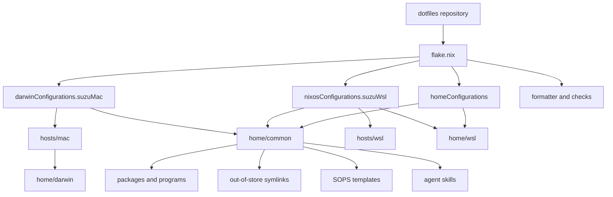

# Architecture and Responsibilities

This repository builds macOS and NixOS-WSL target environments from a single flake. Nix evaluates dependencies and system configuration, Home Manager assembles the shared user environment, and Homebrew supplements selected macOS applications.

macOS is the current primary environment. NixOS-WSL is an auxiliary target environment for using the shared user environment while working with Unity and similar tools on Windows. Whether the WSL configuration will continue to receive maintenance at the same level as macOS is undecided. [ADR 0003](adr/0003-treat-macos-as-primary-environment.md) records the rationale for this maintenance boundary.

## Configuration flow

```mermaid
flowchart TD
  Repo[dotfiles repository] --> Flake[flake.nix]
  Flake --> Darwin[darwinConfigurations.suzuMac]
  Flake --> WSL[nixosConfigurations.suzuWsl]
  Flake --> StandaloneHM[homeConfigurations]
  Flake --> Checks[formatter and checks]

  Darwin --> MacHost[hosts/mac]
  MacHost --> DarwinSystem[home/darwin]
  Darwin --> CommonHome[home/common]

  WSL --> WSLHost[hosts/wsl]
  WSL --> WSLHome[home/wsl]
  WSL --> CommonHome
  StandaloneHM --> WSLHome
  StandaloneHM --> CommonHome

  CommonHome --> Packages[packages and programs]
  CommonHome --> Links[out-of-store symlinks]
  CommonHome --> Secrets[SOPS templates]
  CommonHome --> AgentSkills[agent skills]
```

`flake.nix` is the entry point for target environments and checks. Both macOS and WSL load the shared user environment; operating-system- and host-dependent settings are separated into individual modules. [ADR 0010](adr/0010-share-home-manager-configuration-across-macos-and-wsl.md) records why this sharing boundary was chosen.

## Flake outputs

| Output | System | Responsibility |
| --- | --- | --- |
| `darwinConfigurations.suzuMac` | `aarch64-darwin` | macOS system and Home Manager configuration for the primary environment |
| `nixosConfigurations.suzuWsl` | `x86_64-linux` | NixOS-WSL system and Home Manager configuration for the auxiliary target environment |
| `homeConfigurations.nixos` | `x86_64-linux` | Standalone Home Manager output for the auxiliary target environment |
| `homeConfigurations."nixos@suzuWsl"` | `x86_64-linux` | The same WSL Home Manager configuration, with a host-qualified output name |
| `checks.aarch64-darwin.*` | `aarch64-darwin` | Formatters, static analysis, and shell and configuration validation run on the primary environment |

On macOS, nix-darwin owns system configuration. On WSL, the NixOS-WSL module builds the foundation and Home Manager adds the user environment.

## Nix module boundaries

| Location | Responsibility |
| --- | --- |
| `.config/nix/hosts/` | Host-specific system entry points |
| `.config/nix/home/common/` | Packages, programs, dotfiles, SOPS, and agent skills shared by both target environments |
| `.config/nix/home/darwin/` | macOS user configuration, system defaults, Homebrew, and launchd |
| `.config/nix/home/wsl/` | WSL user name, home directory, and browser integration |
| `.config/nix/overlays/` | Local packages shared through the flake |

Place new configuration for only one target environment in its corresponding platform or host module. Use `home/common/` only when identical behavior is required in both target environments.

## Nix and Homebrew boundary

Nix manages CLI tools, development tools, shells, editors, and system configuration. Homebrew supplements macOS GUI applications and macOS-specific tools that Nix does not handle well.

`.config/nix/home/darwin/homebrew.nix` divides applications into the following sets:

- **`managedBrews`**: Formulae installed by nix-darwin.
- **`managedCasks`**: Casks installed by nix-darwin.
- **`manualCasks`**: Casks whose presence is recorded but which are not operated automatically.

Activation refreshes Homebrew metadata and upgrades managed formulae, casks, and Mac App Store applications. Self-updating casks use their own updater, and only casks that need Homebrew to force an update are marked `greedy` individually. Cleanup remains disabled, so packages outside the managed set are not removed.

## macOS activation exceptions

Instead of using Home Manager's application-copying behavior, Nix-installed GUI applications are exposed as macOS aliases in `/Applications/Nix Apps` from the current system closure. This keeps them discoverable through Spotlight without making a copy diverge from the Nix store source of truth. [ADR 0014](adr/0014-publish-nix-apps-as-macos-aliases.md) records this publication method.

Home Manager's LaunchAgent activation is replaced with custom handling to avoid a regression where `launchctl bootout --wait` fails on recent macOS versions. It compares generations and stops and re-registers only changed agents; destination plists changed by their consumers are never removed automatically. [ADR 0013](adr/0013-override-home-manager-launchagent-activation.md) records the workaround and its removal criteria.

## Dotfile distribution

Home Manager creates out-of-store symlinks from `~/dotfiles` into XDG configuration and home directories. Because repository files are the configuration source of truth, a linked dotfile takes effect at its destination immediately after editing.

The shared user environment links the following configuration:

- Terminal and shell: Fish, WezTerm, Ghostty, tmux, and Oh My Posh.
- Editors and development tools: Neovim, Git, GitHub CLI, lazygit, mise, cxr, and vde.
- Interaction support: bat, btop, gomi, herdr, and Yazi.
- Home-directory files: `.gitconfig`, `.zshrc`, `.zshenv`, and `.zprofile`.

macOS also links AeroSpace, JankyBorders, and Karabiner-Elements configuration.

Some configuration directories exist in the repository but are not linked by the current Home Manager module. Before changing `.config/chezmoi`, `.config/homebrew`, `.config/macSKK`, `.config/vscode`, or `.config/zsh`, confirm how the target application reads it.

This approach fixes the checkout path to `~/dotfiles`. The repository is used from the earliest stage of setting up the environment, so it is kept outside the usual ghq layout at a short, stable path. [ADR 0001](adr/0001-use-out-of-store-symlinks.md) records the rationale.

## Agent configuration

`.config/nix/home/common/agent-skills.nix` registers flake inputs and the repository's `skills/` directory as Agent Skill Sources. It enables personal skills and Matt Pocock's skills together, while selecting other external skills explicitly as needed.

Managing this with Nix reproduces the same agent environment on macOS and WSL and keeps external-skill versions and local policy in one place. External skill versions are pinned in `flake.lock`; [ADR 0004](adr/0004-manage-agent-skills-with-nix.md) records this installation path.

When an external skill's instructions do not fit local operations, transform it in the Home Manager module. The current transforms include a policy to run CLIs through `npx` rather than installing them globally.

Enabled skills are placed in `~/.agents/skills`. Codex-wide instructions and its question guide are managed separately, with `codex/` linked to `~/.codex/`.

## Secret boundary

Secrets are encrypted with SOPS and materialized into required configuration files during Home Manager activation. The decryption key is stored outside the repository at `~/.config/sops/age/keys.txt`. [ADR 0006](adr/0006-manage-secrets-with-sops.md) records why only encrypted secrets are versioned.

The encrypted `.config/nix/secrets/secrets.yaml` is tracked by Git, but its contents must not be read during routine investigation or documentation work. Secrets used by GitHub Actions are passed from GitHub Secrets and are not copied into local configuration.

## CI coverage

| Change area | Main verification |
| --- | --- |
| Nix modules and flake | Formatter, Statix, deadnix, macOS build, and WSL build |
| Shell scripts and Fish | ShellCheck and Fish syntax checks |
| Python skill scripts | Ruff |
| Neovim | Restore from `lazy-lock.json` and headless startup |
| WezTerm | Load configuration on a virtual display |
| GitHub Actions | actionlint and additional security linting |
| Renovate | Configuration validator |

Static checks are collected in flake checks for the current primary environment, macOS. The WSL configuration is built separately on a Linux runner to confirm that the auxiliary target environment can be reconstructed. Its future maintenance level is undecided, so this CI arrangement is not a permanent guarantee.

## Pinning and updates

Nix inputs, Neovim plugins, and GitHub Actions pin their resolved versions through lockfiles or commit SHAs. Renovate proposes Nix and GitHub Actions updates and lockfile maintenance. Verified Nix dependency updates may be merged automatically, while GitHub Actions changes are reviewed by a person because they alter workflow behavior. [ADR 0015](adr/0015-pin-and-automate-dependency-updates.md) records this boundary.

## Design decisions

- [Application configuration and operating policy](applications.md)
- [ADR 0001: Distribute dotfiles through out-of-store symlinks](adr/0001-use-out-of-store-symlinks.md)
- [ADR 0002: Separate Nix and Homebrew responsibilities](adr/0002-split-nix-and-homebrew-responsibilities.md)
- [ADR 0003: Treat macOS as the primary environment](adr/0003-treat-macos-as-primary-environment.md)
- [ADR 0004: Manage Agent Skills with Nix](adr/0004-manage-agent-skills-with-nix.md)
- [ADR 0005: Manage language runtimes with Nix](adr/0005-manage-language-runtimes-with-nix.md)
- [ADR 0006: Manage secrets encrypted with SOPS](adr/0006-manage-secrets-with-sops.md)
- [ADR 0007: Build Japanese input around macSKK](adr/0007-build-japanese-input-around-macskk.md)
- [ADR 0008: Share Vim-style navigation across applications](adr/0008-share-vim-style-navigation-across-apps.md)
- [ADR 0009: Keep dotfiles specific to the personal environment](adr/0009-keep-dotfiles-specific-to-personal-environment.md)
- [ADR 0010: Share Home Manager configuration across macOS and WSL](adr/0010-share-home-manager-configuration-across-macos-and-wsl.md)
- [ADR 0011: Manage Neovim plugins with lazy.nvim](adr/0011-manage-neovim-plugins-with-lazy-nvim.md)
- [ADR 0012: Separate Neovim development-tool responsibilities](adr/0012-separate-neovim-tool-responsibilities.md)
- [ADR 0013: Override Home Manager LaunchAgent activation](adr/0013-override-home-manager-launchagent-activation.md)
- [ADR 0014: Publish Nix GUI applications as macOS aliases](adr/0014-publish-nix-apps-as-macos-aliases.md)
- [ADR 0015: Pin external dependencies and update them with Renovate](adr/0015-pin-and-automate-dependency-updates.md)
