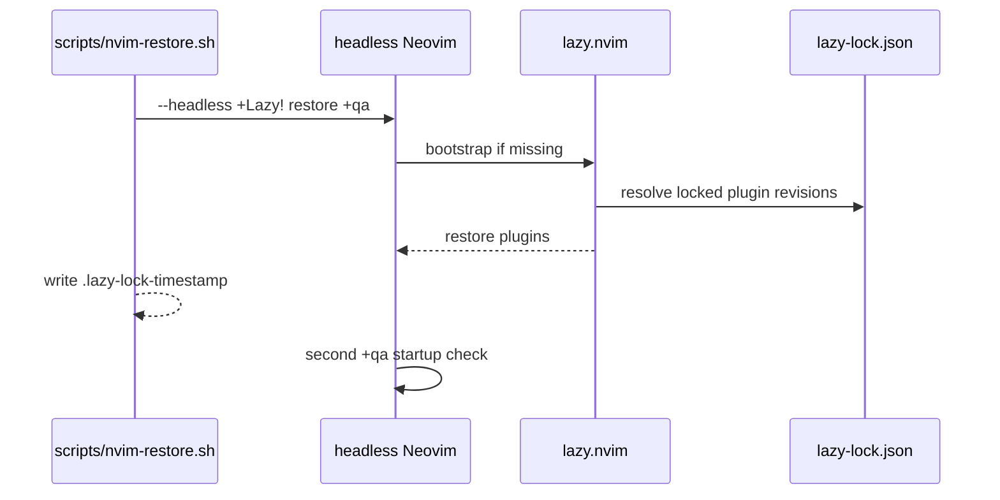

# Neovim configuration and restoration

`.config/nvim/init.lua` loads `config.lazy` and `config`. `lua/config/lazy.lua` bootstraps `lazy.nvim` into Neovim’s data directory when absent, sets leader keys, imports `lua/plugins`, disables startup update checks, and uses `lazy-lock.json` as the plugin version contract. Options, keymaps, autocmds, commands, and plugin declarations live in their corresponding `lua/config` and `lua/plugins` modules.



`scripts/nvim-restore.sh` fails fast with `set -euo pipefail`, accepts the Neovim config directory plus optional Lazy directory and binary, then invokes `Lazy! restore`. `git` and network access are required when the bootstrap or plugin cache is absent. Lazy itself is cloned from its stable branch at runtime; the plugin revisions are the part pinned in `lazy-lock.json`.

## Focused validation

```bash
nix shell nixpkgs#neovim nixpkgs#git -c ./scripts/nvim-restore.sh ~/.config/nvim
nix shell nixpkgs#neovim nixpkgs#git -c nvim --headless "+qa"
```

The path-filtered `nix-nvim.yaml` workflow checks out the repository, runs the shared Nix setup action, links `${GITHUB_WORKSPACE}/.config/nvim` to `~/.config/nvim`, restores plugins through `nix shell nixpkgs#neovim nixpkgs#git -c`, and then starts `nvim --headless '+qa'`. The link is important: Lazy writes its bootstrap/plugin state under the normal user data paths while the configuration remains the checkout source; the workflow does not build a Darwin or WSL system generation. Its filters include `.config/nvim/**`, `lazy-lock.json`, `scripts/nvim-restore.sh`, `flake.nix`, `flake.lock`, and the Nix setup action, so dependency/setup changes can trigger it even without a Neovim source edit.

The path-filtered `nix-nvim.yaml` workflow performs the restore and headless startup checks. These prove reproducible restoration and noninteractive startup, not plugin feature correctness, keymap behavior, or LSP operation.
