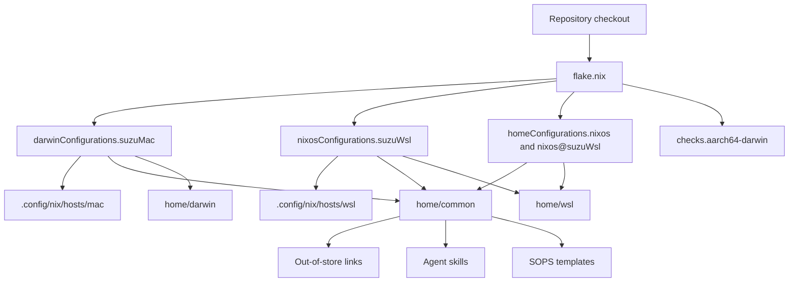

# Flake architecture and configuration flow

This repository is a personal, flake-first environment definition. `flake.nix` is the composition root: it pins inputs through `flake.lock`, defines `aarch64-darwin` and `x86_64-linux`, injects usernames/host names and inputs into modules, applies shared overlays, and exposes buildable environments plus validation outputs. Darwin passes `self`, `inputs`, and `username` to nix-darwin; NixOS-WSL passes `inputs` and `username`; standalone WSL Home Manager passes `inputs`, `username`, and `enableAgentSkills` directly.

Darwin composes `nixpkgs`, `nix-darwin`, `home-manager`, `nix-homebrew`, `sops-nix`, `nix-index-database`, local overlays, `hosts/mac`, common Home Manager, and Darwin Home Manager. NixOS-WSL composes `nixpkgs`, `nixos-wsl`, `home-manager`, `sops-nix`, `nix-index-database`, local overlays, `hosts/wsl`, common Home Manager, and WSL Home Manager. Agent inputs are passed through `inputs` and all current compositions set `enableAgentSkills = true`. The standalone `homeConfigurations.nixos` and `homeConfigurations.\"nixos@suzuWsl\"` reuse `wslHomeConfiguration`: it evaluates `wslPkgs`, applies `sharedOverlays` in an inline module, passes `inputs`, `username = \"nixos\"`, and `enableAgentSkills`, then imports `wslHomeImports` and `wslHomeSharedModules`. Embedded Home Manager runs as part of Darwin/NixOS system activation and receives host module arguments; both embedded paths set `useGlobalPkgs = true` and `useUserPackages = true`, so common packages and overlays resolve through the host package set. Home Manager state is `25.11`; the WSL system state is `26.05`. Darwin’s home root is `/Users/k25012kk`; WSL’s is `/home/nixos`. WSL sets `BROWSER = \"explorer.exe\"` and makes Fish the system shell; macOS sets its home identity and macOS environment in `home/darwin/home.nix`, while host defaults configure the native desktop rather than WSL.

## Outputs and ownership

| Output | System | Owner and use |
| --- | --- | --- |
| `darwinConfigurations.suzuMac` | `aarch64-darwin` | nix-darwin system plus Home Manager for the primary macOS host |
| `nixosConfigurations.suzuWsl` | `x86_64-linux` | NixOS-WSL system plus Home Manager |
| `homeConfigurations.nixos` | `x86_64-linux` | Standalone WSL Home Manager |
| `homeConfigurations."nixos@suzuWsl"` | `x86_64-linux` | Host-qualified alias of the WSL Home Manager configuration |
| `checks.aarch64-darwin.*` | `aarch64-darwin` | Formatting, static analysis, syntax, and workflow validation |

Common user behavior belongs in [`common Home Manager`](../systems/common-home.md); target-only behavior belongs in [`macOS`](../systems/macos.md) or [`WSL`](../systems/wsl.md). Local package composition is documented in [`packages and overlays`](../systems/packages-and-overlays.md).

## Module boundaries and invariants

- `.config/nix/hosts/` owns operating-system and host entrypoints.
- `.config/nix/home/common/` owns behavior intended to be identical on both targets.
- `.config/nix/home/darwin/` owns macOS user/system integration; `.config/nix/home/wsl/` owns WSL-specific user behavior.
- `.config/nix/overlays/` supplies repository-local packages through `localOverlays`.
- `~/dotfiles` is a runtime prerequisite because common Home Manager creates out-of-store links into that checkout.
- macOS is the primary target; WSL is an auxiliary target with closure-build coverage rather than boot/runtime coverage.

The Nix and Homebrew boundary is deliberate: Nix owns CLI/development tools and declarative system settings; Homebrew supplements selected macOS applications. Flake-level substituters are `https://suzuuuuu09.cachix.org`, `https://nix-community.cachix.org`, and `https://cache.numtide.com`, with their trusted public keys; Darwin repeats these persistent settings, while WSL configures the Numtide cache in its host module and CI adds Cachix through the setup action (pulls enabled, pushes skipped for pull requests). `flake.lock` is the Nix dependency source of truth; `lazy-lock.json` and action commit SHAs are separate reproducibility boundaries. For an input upgrade, classify the input URL/`flake = false` status, inspect the lock diff, run `nix flake check`, build both target outputs, verify explicit skill paths/overlay packages, and check cache setup. Nix/lockfile changes trigger `nix-build.yaml`; Neovim paths plus `flake.nix`, `flake.lock`, its workflow, or setup action trigger `nix-nvim.yaml`; WezTerm paths plus its workflow/setup action trigger `wezterm-linter.yaml`; the remaining action, Renovate, and OpenWiki workflows have their own workflow/configuration filters. Review each filter explicitly because a shared module or application change can otherwise bypass a specialized workflow. The repository provides no automated compatibility test for upstream skill semantics, Homebrew state, or live WSL/macOS behavior. Secrets remain encrypted in the repository and are materialized only during Home Manager activation; see [`secrets and activation`](../operations/secrets-and-activation.md).

## Change routing

Start from the intent rather than the directory tree. Change the flake output or composition in `flake.nix`, shared user behavior in `home/common`, and target behavior in the corresponding platform module. After a Nix change, use `nix flake check`; for a target-specific change, also build the relevant output.
