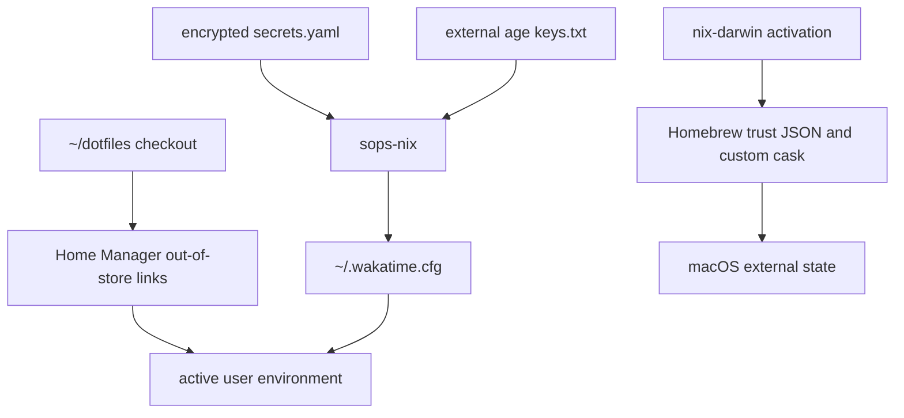

# Secrets and activation state

The repository tracks encrypted `.config/nix/secrets/secrets.yaml`; it must not be inspected as plaintext. `.config/nix/home/common/sops.nix` expects the age key at `~/.config/sops/age/keys.txt`, declares `wakatime_api_key`, and renders the secret into `~/.wakatime.cfg` using a sops-nix placeholder. On Darwin the key root is `/Users/k25012kk/.config/sops/age/keys.txt`; on WSL it is `/home/nixos/.config/sops/age/keys.txt`. The external age key is the decryption authority; the encrypted file is the versioned source, and the rendered file is generated activation state. The source does not define key provisioning, rotation, a merge policy for an existing `.wakatime.cfg`, or custom generated-file permissions; missing key/ciphertext is an activation prerequisite failure rather than a case with a plaintext fallback.

`dotfiles.nix` creates out-of-store symlinks rooted at `${config.home.homeDirectory}/dotfiles`, so the checkout at `~/dotfiles` is the live source for linked configuration. This is different from SOPS-rendered files and from macOS activation outputs. A missing checkout prevents link resolution; a missing age key prevents secret materialization; neither should be replaced with a committed plaintext fallback.

Activation composes system modules, Home Manager modules, SOPS handling, links, and macOS extra activation scripts. sops-nix reads `defaultSopsFile`, decrypts the declared `wakatime_api_key`, substitutes its placeholder into the template, and writes/reconciles `~/.wakatime.cfg`; the repository does not specify a merge with an existing file, so treat the generated path as activation-owned and back up any local customization before changing the template. Homebrew’s extra script writes trust files with user ownership and mode `0600`, then installs the local custom cask into the Homebrew tap. These generated files are not repository source and may be partially updated if activation fails.

## Safe recovery

- If `~/dotfiles` is absent or moved, restore the checkout at that path or update the documented `dotfilesPath` expressions before activating.
- If decryption fails, provision the correct external age key and retry; do not decrypt or commit the secret payload.
- If a symlink or activation step fails, inspect the failing generation and filesystem ownership before rerunning; generated Homebrew trust state can be repaired by a successful Darwin activation.
- If Homebrew activation fails after an upgrade, treat Homebrew’s external state as changed and inspect `brew` state independently before retrying.

Run `nix flake check` and the target build before activation. Secrets, tokens, private keys, and `.env` files are outside documentation scope.
