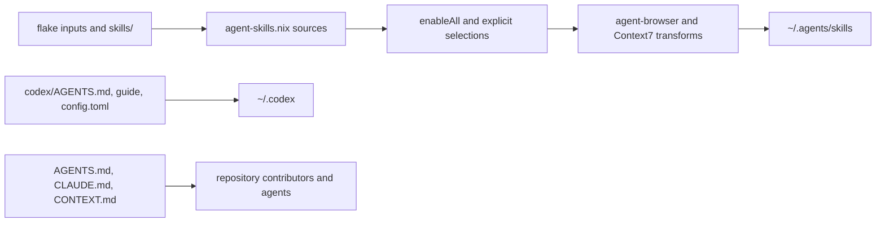

# Agent and Codex environment

The repository has two related but distinct surfaces. Root `AGENTS.md`, `CLAUDE.md`, and `CONTEXT.md` guide contributors and agents working in the checkout. `codex/AGENTS.md`, `codex/config.toml`, and `codex/guide/` are the Codex runtime surface: `programs/codex` links the directory to `~/.codex`, and the macOS system module also publishes the Codex config where required. They are policy/configuration inputs, not Nix package code.

`.config/nix/home/common/agent-skills.nix` imports `inputs.agent-skills.homeManagerModules.default` and maps named sources: `vercel`, `v-agent`, `anthropics`, `agent-browser`, `context7`, `mattpocock`, `mizchi`, `ui-ux-pro-max`, `stop-ai-slop-jp`, `handoff`, `japanese-tech-writing`, and local `personal`. `vercel`, `v-agent`, `anthropics`, `agent-browser`, `context7`, `mattpocock`, and `mizchi` select their input’s `skills` subdirectory; UI/UX and stop-ai-slop select the repository root; handoff, Japanese writing, and local `${inputs.self}/skills` use `filter.maxDepth = 1`. `enableAll` applies to `personal` and `mattpocock`; explicit mappings select `frontend-design`, `find-skills`, `web-design-guidelines`, `empirical-prompt-tuning`, `ui-ux-pro-max`, `stop-ai-slop-jp`, `handoff`, `japanese-tech-writing`, `agent-browser`, and `find-docs`. With `enableAgentSkills = true`, Home Manager installs the result under `~/.agents/skills` on both macOS and WSL. A new skill can be lost by defining a source without selecting it, selecting a path that does not exist, placing content outside the depth filter, or changing `codex/` without changing the separately linked Codex surface.

The transformations enforce local policy: `agent-browser` must run through `npx agent-browser@latest` rather than global npm installation, and `find-docs` is rewritten to use `npx @mattpocock/find-docs@latest` rather than a global command. These are exact text replacements, so upstream instruction wording changes can make a transform ineffective. External versions are controlled by `flake.lock`; broad `enableAll` selections can also expand when upstream repositories change.

Codex is declaratively installed from `inputs.llm-agents.packages` and its repository `AGENTS.md`/`guide` are linked into `~/.codex`; `codex/config.toml` is the client configuration surface. `programs.pi` and the Copilot module/configuration are separate consumers of the same general agent policy. `/copilot/mcp-config.json` is a user-managed runtime MCP surface rather than a generated Home Manager skill directory: it registers Context7 and Serena via `npx` commands, filesystem access with an expanded home path, and Chrome DevTools through its configured command/arguments/environment. Keep its environment variables and filesystem scope reviewable and do not treat an MCP server as proof that a skill was installed declaratively.

The repository’s `skills/` tree contains local skill implementations and scripts. Ruff covers Python scripts under `skills/fetch-markdown/scripts` and `skills/timezone-utils/scripts`; there is no general skill runtime test suite. The OpenWiki update workflow treats root instruction files as documentation-update inputs, so instruction changes can affect generated wiki maintenance without being installed as ordinary agent skills.

## Change and validation surface

When adding a skill, update the flake input if external, add a `sources` entry, then add `enableAll` or an `explicit` mapping and any required transform. Confirm the source path and build the relevant Home Manager target. Run `nix flake check` and Ruff for Python skill scripts. Keep secrets and private credentials out of instruction or skill files.
