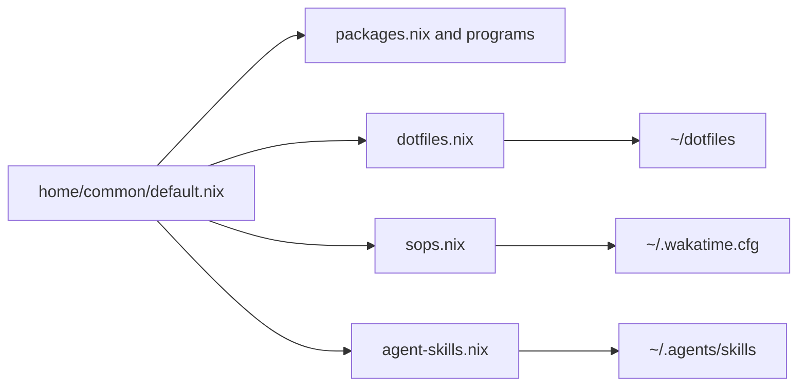

# Shared Home Manager environment

`.config/nix/home/common/default.nix` is the shared user layer. `flake.nix` imports it for both `darwinConfigurations.suzuMac` and the WSL configurations, so changes here cross the platform boundary. It sets the Home Manager state version, editor variables, XDG behavior, and imports packages, programs, dotfile links, SOPS, and agent skills.

## Dotfile contract

`dotfiles.nix` defines `dotfilesPath = "${config.home.homeDirectory}/dotfiles"` and `mkLink`, which calls `config.lib.file.mkOutOfStoreSymlink`. On Darwin, `config.home.homeDirectory` is `/Users/k25012kk`; on WSL it is `/home/nixos`, so the source is respectively `/Users/k25012kk/dotfiles` or `/home/nixos/dotfiles`. It links `bat`, `cxr`, `oh-my-posh`, `nix`, `nvim`, `yazi`, `tmux`, Fish, `gh`, `gomi`, `lazygit`, WezTerm, Ghostty, `btop`, `mise`, `vde`, `git`, and `herdr` under `~/.config`, plus `.gitconfig`, `.zshrc`, `.zshenv`, and `.zprofile` in the home directory. Darwin adds AeroSpace, borders, and Karabiner mappings in its platform module. The checkout is the live source of truth and must remain at the platform’s `~/dotfiles`; outside that location links resolve to missing paths. Add a new application only after checking that its destination is not already owned by a Home Manager program or existing link; declare its mapping here and validate the target build.

Some directories exist in the repository but are not linked by this module, including `.config/chezmoi`, `.config/homebrew`, `.config/macSKK`, `.config/vscode`, and `.config/zsh` (the Zsh mapping is commented out). Treat these as separate ownership questions rather than assuming Home Manager activates them. Home Manager will not automatically adopt a newly added file inside an unlinked directory, and an existing destination owned by another program must be inspected before adding a mapping: a new `xdg.configFile` or `home.file` declaration can conflict with that owner during activation. On macOS, `home-manager.backupFileExtension = "backup"` gives conflicting existing Home Manager destinations a backup suffix; WSL does not set that Darwin-specific option. Adding a link therefore changes both generations and the live checkout destination; relocating/removing one leaves the old destination subject to Home Manager cleanup and can expose a missing consumer config, while generated files such as `~/.wakatime.cfg` follow the sops activation lifecycle instead of this link cleanup. Add the declaration only when the destination and runtime consumer are clear, then build the target generation before switching.

## Shared programs and packages

`packages.nix` provides the common command-line environment. `programs/default.nix` composes small modules for `czg`, npm, Codex, `nh`, `pi`, and direnv, while `programs/treefmt.nix` and `programs/git-hooks.nix` feed flake validation. Local package definitions and their overlay consumers are in [`packages and overlays`](packages-and-overlays.md). Application-specific linked configuration is routed through [`terminal and tools`](../applications/terminal-and-tools.md) and [`development tools`](../applications/development-tools.md).

## Secret and agent integration

`sops.nix` reads the encrypted `../../secrets/secrets.yaml` using the external age key `${config.home.homeDirectory}/.config/sops/age/keys.txt`, then renders `~/.wakatime.cfg`; it never makes the encrypted payload a plaintext repository artifact. `agent-skills.nix` is enabled by `enableAgentSkills = true` in both flake compositions and installs selected skills under `~/.agents/skills`. The complete source/selection/transform surface is documented in [`agent environment`](agent-environment.md).

## Validation

Use `nix flake check` for the shared module graph and static checks. Build `.#darwinConfigurations.suzuMac.system` after macOS-sensitive changes and `.#nixosConfigurations.suzuWsl.config.system.build.toplevel` after WSL-sensitive changes. Since linked files are live, application-level checks are described on the relevant application pages.
