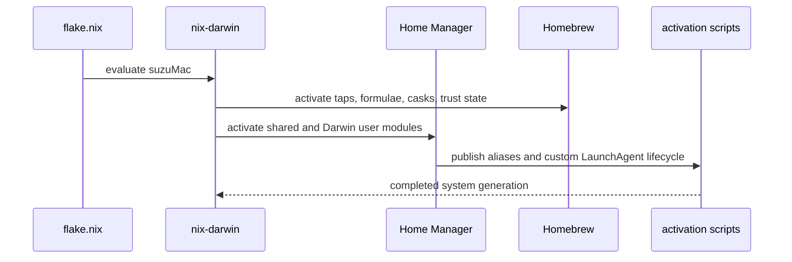

# macOS nix-darwin environment

`darwinConfigurations.suzuMac` in `flake.nix` targets `aarch64-darwin`, injects username `k25012kk`, imports `.config/nix/hosts/mac`, nix-homebrew, Home Manager, and the shared Home Manager layer. `.config/nix/home/darwin/home.nix` adds macOS user modules: launchd handling, packages, SSH, Homebrew, macSKK, and system defaults. The platform comparison is intentional: WSL’s `home/wsl/default.nix` sets `BROWSER = "explorer.exe"` and the WSL host makes Fish the login shell; the macOS Home Manager layer does not set a `BROWSER` override, relying on native macOS application defaults while shared Fish/Zsh configuration remains available.



Nix owns CLI/development tools and system settings; Homebrew supplements GUI applications and macOS-specific tools. Nix GUI applications are exposed as aliases under `/Applications/Nix Apps` rather than copied. The custom LaunchAgent activation compares generations and stops/re-registers changed agents without removing consumer-modified destination plists; this avoids the recent `launchctl bootout --wait` failure mode.

The host modules also cover remote access and SSH. The LaunchAgent workaround is `home.activation.setupLaunchAgents = lib.mkForce (lib.hm.dag.entryAfter ["writeBoundary"] ...)`, so it replaces Home Manager’s normal activation step after the write boundary. `dstDir` is `${config.home.homeDirectory}/Library/LaunchAgents` (for this host, `/Users/k25012kk/Library/LaunchAgents`); `setupLaunchAgents` compares `$newGenPath/LaunchAgents` with `$oldGenPath/LaunchAgents`, reads optional `.domain` metadata from parallel `LaunchAgentDomains` directories, defaults invalid/missing values to `gui`, and resolves `gui`/`user` to `gui/$UID`/`user/$UID`. `processAgent` skips identical plist content and domain, otherwise boots out the old agent, installs the new file with mode `0444`, and bootstraps it. `removeAgent` skips files still present in the new generation or files whose destination contents diverged, then boots out and removes matching obsolete files. `set +e` lets all agents be processed: bootout failures are logged (with “No such process” treated as benign); bootstrap failures containing launchctl I/O error 5 are diagnosed as a known condition, while other installation/bootstrap/removal failures are logged and activation continues; `set -e` is restored at the end. System defaults, keyboard/input behavior, and macOS application links are distinct from the shared environment: see [`desktop and input`](../applications/desktop-and-input.md) and [`Homebrew operations`](../operations/homebrew.md).

## Apply and validate

```bash
nix build --no-link .#darwinConfigurations.suzuMac.system
sudo darwin-rebuild switch --flake .#suzuMac
```

Use `nix flake check` for static checks. Homebrew activation requires macOS, a working `/opt/homebrew`, and its external network/application state; the managed/manual ownership and recovery implications are documented on the Homebrew page. The configuration intentionally contains personal username/host values and is not a generic template.
