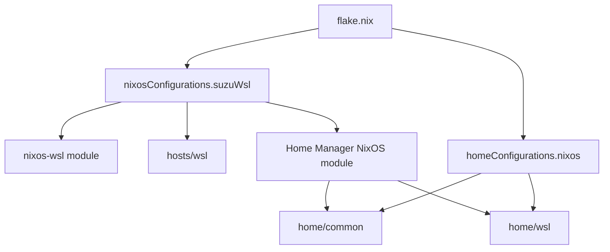

# NixOS-WSL environment

`nixosConfigurations.suzuWsl` targets `x86_64-linux`, username `nixos`, and host name `suzuWsl`. It composes `nixos-wsl.nixosModules.default`, `.config/nix/hosts/wsl`, Home Manager’s NixOS module, and the shared plus WSL Home Manager imports. The same `wslHomeConfiguration` is exposed as `homeConfigurations.nixos` and `homeConfigurations."nixos@suzuWsl"`.

`.config/nix/hosts/wsl/default.nix` enables WSL, sets the default user, enables flakes and the new Nix CLI, configures the binary cache, selects Fish, and installs baseline `git` and `neovim`. `.config/nix/home/wsl/default.nix` sets `/home/${username}` and `BROWSER=explorer.exe`, while common modules supply the main user environment.



The shared dotfile contract still expects the checkout at `~/dotfiles`. CI validates closure construction, not boot, login, Windows interop, Fish startup, or Home Manager activation inside a live WSL instance. WSL is an auxiliary maintenance target; avoid assuming macOS-only modules or Homebrew behavior apply here.

## Validate and apply

```bash
nix build --no-link .#nixosConfigurations.suzuWsl.config.system.build.toplevel
sudo nixos-rebuild switch --flake .#suzuWsl
```

For standalone user changes, build the relevant `homeConfigurations` output. Use the common Home Manager and application pages to trace shared behavior.
